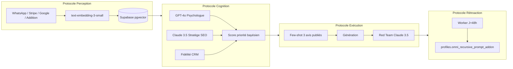

# Architecture Omni-Synapse — Écosystème auto-évolutif

Ce document remplace la vision **réactive** (traitement ponctuel d’un événement) par un **écosystème auto-évolutif** : la plateforme apprend de chaque canal, arbitre les décisions avant agir, génère avec le ton de la maison, et corrige ses propres prompts lorsque la boucle de publication échoue.

## Vue d’ensemble

## 1. Protocole de Perception unifiée

- **Objectif** : toute interaction métier devient une **mémoire sémantique**, pas une ligne froide.
- **Modèle** : `text-embedding-3-small` (1536 dimensions), aligné avec le reste du RAG REPUTEXA.
- **Stockage** : table `omni_interaction_memories` + index HNSW ; RPC `match_omni_interaction_memories` pour requêtes du type *« clients mécontents du service mais enthousiastes sur la terrasse »*.
- **Code** : `lib/omni-synapse/perception.ts`.
- **Ingress faible latence** :
  - Route Next **Edge** : `POST /api/edge/omni/ingest` (Bearer `CRON_SECRET`).
  - Fonction Supabase Edge : `supabase/functions/omni-synapse-ingest` (Bearer `OMNI_INGEST_SECRET` optionnel).

## 2. Protocole de cognition multi-couche (table ronde virtuelle)

Avant une action coûteuse (génération, escalade humaine, priorisation file), trois experts synthétiques produisent des signaux **bornés 0–1** :

| Expert | Modèle / source | Rôle |
|--------|-----------------|------|
| Psychologue | **GPT-4o** | Urgence émotionnelle, valence dominante |
| Stratège SEO | **Claude 3.5 Sonnet** (via `generateText`) | Mots-clés manquants sur la fiche Google, `seoGapScore` |
| Fidélité | Donnée CRM `visitCount` | Premier passage vs client « champion » (10e visite) |

**Agrégation** : combinaison multiplicative conservative  
\(\text{priority} = 1 - \prod_i (1 - w_i s_i)\) avec poids par défaut  
psychologue **0.38**, stratège **0.35**, fidélité **0.27**.

- **Code** : `lib/omni-synapse/cognition-round-table.ts` (`runVirtualRoundTable`).

## 3. Protocole d’exécution haute couture

- **Few-shot dynamique** : les **3 meilleurs avis déjà publiés** (`response_text` non nul, statut `published` ou `pending_publication`, tri par note) servent de **calque tonale**.
- **Rédaction** : chaîne existante `generateText` (Claude prioritaire).
- **Red teaming** : second passage Claude en auditeur **RGPD + anti-robot** ; si `approved: false`, la réponse n’est pas livrée (`draftReply` vide).
- **Apprentissage récursif** : le fragment `profiles.omni_recursive_prompt_addon` est injecté dans le prompt d’exécution.
- **Code** : `lib/omni-synapse/execution-haute-couture.ts` (`executeHauteCoutureReply`).

## 4. Protocole de rétroaction récursive

- À l’envoi effectif d’un message (`review_queue.sent_at`), enregistrer une échéance **+48h** via `registerPublicationFollowup` → table `omni_publication_followups`.
- Worker planifié : `GET /api/cron/omni-recursive-scan` (même convention `Authorization: Bearer CRON_SECRET` que les autres crons).
- Si `metadata.google_review_confirmed === false` → analyse Claude (`analyzeFailureAndProposePromptDelta`) et **fusion** du `prompt_delta` dans `profiles.omni_recursive_prompt_addon` (`mergePromptAddonIntoProfile`).
- **Code** : `lib/omni-synapse/recursive-feedback.ts` et `app/api/cron/omni-recursive-scan/route.ts`.

> **Intégration Google** : tant que la confirmation de publication n’est pas branchée (webhook / polling GBP), le champ `google_review_confirmed` peut rester absent ; le worker classe alors l’issue en `unknown` sans modifier le prompt. Dès que le connecteur pose `false` après 48h, la boucle d’auto-optimisation s’active.

## 5. Déploiement & variables

| Variable | Usage |
|----------|--------|
| `OPENAI_API_KEY` | Embeddings + GPT-4o (psychologue) |
| `ANTHROPIC_API_KEY` | Stratège SEO, rédaction, red team |
| `SUPABASE_SERVICE_ROLE_KEY` | RPC vector, cron, ingest serveur |
| `CRON_SECRET` | Auth routes `/api/cron/*` et `/api/edge/omni/ingest` |
| `OMNI_INGEST_SECRET` | (Optionnel) Auth stricte fonction Deno `omni-synapse-ingest` |

## 6. Migration base de données

Fichier : `supabase/migrations/100_omni_synapse.sql`  
(nouvelles tables + fonction `match_omni_interaction_memories` + colonne `omni_recursive_prompt_addon` sur `profiles`).

Après déploiement : `supabase db push` ou pipeline migrations habituel.

## 7. Chaînage avec l’existant

- Les flux **Zenith / Triple Judge** (`lib/ai/zenith-triple-judge.ts`) et **`ai-service`** restent la colonne vertébrale ; Omni-Synapse est une **couche d’orchestration** au-dessus (priorisation, mémoire longue, conformité renforcée, apprentissage prompt).

### Branchements opérationnels (implémentés)

| Signal | Fichiers / entrées |
|--------|---------------------|
| **Perception POS** (`addition`) | Après enqueue : `app/api/webhooks/[api_key]/route.ts`, `app/api/webhooks/zenith/route.ts` → `safeIngestPosQueueEvent`. |
| **Perception WhatsApp** | Envoi file d’attente : `app/api/cron/send-messages/route.ts`, `send-zenith-messages/route.ts` → `safeIngestWhatsAppOutbound`. Réponses clients : `app/api/webhooks/whatsapp-incoming/route.ts` (retours satisfaits / insatisfaits / avis poli). |
| **Perception avis** (`google` / plateformes) | `safeIngestPlatformReviewWebhook` : `google-reviews`, `platforms/google`, `facebook`, `trustpilot`, `email-ingest` ; création dashboard `app/api/supabase/reviews/route.ts`. |
| **Perception Stripe** | `invoice.paid` : `app/api/stripe/webhook/route.ts` → `safeIngestStripeBillingSignal`. |
| **Rétroaction J+48h** | Après envoi réel : mêmes crons send-messages / send-zenith → `safeScheduleOmniPublicationFollowup`. Métadonnée `publish_link_sent_at` posée quand le client reçoit le lien Google (`whatsapp-incoming`). Worker : `GET /api/cron/omni-recursive-scan`. |
| **Prompt récursif en génération** | `profiles.omni_recursive_prompt_addon` lu dans `review-reply-brain` (`omniRecursivePromptAddon`) ; profils chargés dans `reviews/route`, `generate-options/route`, `process-bad-review.ts`. |

API optionnelle « haute couture » / table ronde : `executeHauteCoutureReply`, `runVirtualRoundTable` dans `lib/omni-synapse/` (à appeler depuis un écran ou une file priorisée si besoin).
